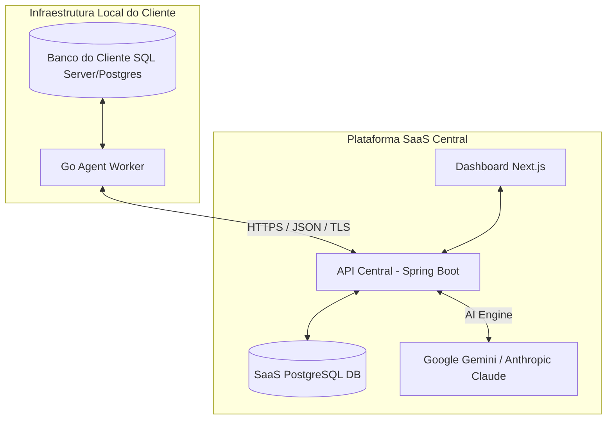

# 🤖 DBA Agent - O Administrador de Banco de Dados Inteligente e Autônomo

O **DBA Agent** é uma plataforma SaaS B2B de ponta projetada para funcionar como um DBA automatizado. O sistema analisa a estrutura, o uso e o desempenho de bancos de dados relacionais (com suporte primário a **Microsoft SQL Server** e **PostgreSQL**) e utiliza Inteligência Artificial avançada (Google Gemini e Anthropic Claude) sob o modelo **BYOK (Bring Your Own Key)** para sugerir otimizações de performance extremamente precisas (como criação de índices, reestruturação de tabelas e refatoração de queries).

Toda alteração sugerida é acompanhada de scripts de aplicação (**Up-Scripts/Deploy**) e de reversão (**Down-Scripts/Rollback**), garantindo segurança absoluta e governança sobre os dados.

---

## 🏗️ Arquitetura do Sistema e Segurança

Por motivos rígidos de compliance e segurança da informação, **a API Central do SaaS nunca se conecta diretamente ao banco de dados do cliente**. Em vez disso, a arquitetura é dividida em três componentes principais:



1. **Agente Worker (`/agent`):** Um executável leve escrito em Go que roda localmente na infraestrutura do cliente. Ele se conecta localmente ao banco, extrai apenas metadados (DDLs) e estatísticas de performance dinâmicas (DMVs, índices ausentes, wait stats) e envia esses dados para a API central via HTTPS.
2. **API Central (`/api`):** Backend robusto em Java com Spring Boot. Ele gerencia as regras de negócio, o cache semântico, criptografa as chaves de API dos clientes, faz a curadoria das solicitações com as LLMs e expõe os endpoints do sistema.
3. **Dashboard Web (`/web`):** Uma interface web premium em Next.js (React) onde os clientes e administradores gerenciam bancos cadastrados, aprovam melhorias sugeridas pelas IAs, monitoram a auditoria e configuram tokens de IA.

---

## ⚡ Funil de Processamento e Otimização

Para reduzir custos de consumo de tokens das IAs e garantir respostas imediatas para problemas conhecidos, o processamento de diagnósticos segue um funil rigoroso:

| Etapa | Ferramenta | Descrição | Custo de IA |
| :--- | :--- | :--- | :--- |
| **1. Linter Estático** | Motor Local do SaaS | Identifica erros estruturais óbvios e determinísticos (ex: tabelas sem Primary Keys, Foreign Keys sem índices) sem acionar LLMs. | **Zero** |
| **2. Cache Semântico** | Postgres Local DB | Verifica se uma estrutura idêntica de banco ou query lenta já foi analisada anteriormente no Tenant, retornando a solução de imediato. | **Zero** |
| **3. Motor de IA** | Gemini / Claude (BYOK) | Acionado para análise profunda e complexa do contexto relacional, estatísticas de uso (DMVs) e consultas pesadas. | **Injetado pelo Cliente** |

---

## 📂 Estrutura do Monorepo

```
/
├── agent/      # Coletor local leve escrito em Go (Windows Service ou CLI)
├── api/        # Backend Central SaaS em Java 21 (Spring Boot & JPA)
└── web/        # Frontend Dashboard em Next.js 15 (React, TailwindCSS, TypeScript)
```

### 🛰️ 1. O Agente Local (`/agent`)
* **Linguagem:** Go 1.26+
* **Drivers Suportados:** SQL Server (`go-mssqldb`) e PostgreSQL (`lib/pq`).
* **Instalação:** Pode ser instalado nativamente como um serviço de sistema operacional (Windows Service) utilizando a biblioteca `kardianos/service`.
* **Fluxo:** Coleta DDLs, queries lentas, Wait Stats e fragmentação de índices em intervalos regulares e faz o envio seguro (HTTPS) para a API Central.

### ☕ 2. A API Central (`/api`)
* **Tecnologias:** Java 21, Spring Boot 3.4, Spring Security, Spring Data JPA, Hibernate, PostgreSQL.
* **Segurança:** Autenticação via JWT, controle de acesso baseado em Perfis (Admin/Client via RBAC).
* **AI Integrada:** Integração direta com APIs oficiais do Anthropic Claude e Google Gemini usando chaves criptografadas associadas ao Tenant do usuário.

### 🌐 3. O Dashboard Web (`/web`)
* **Tecnologias:** React 19, Next.js 15, TypeScript, TailwindCSS, Componentes customizados de UI e visualização de código SQL.
* **Funcionalidades:** Gerenciamento de conexões de bancos, aprovação de melhorias com visualização de diff de código SQL (Up/Down scripts), gerenciamento de usuários multi-tenant e auditoria de ações executadas nos servidores locais.

---

## 🚀 Como Iniciar o Desenvolvimento

### Requisitos Prévios
* Java JDK 21+ instalado
* Go Compiler 1.26+ instalado
* Node.js 20+ instalado
* PostgreSQL ativo (para a base de dados do SaaS `dba_agent_db`)

---

### 🟢 Iniciando a API Central (`/api`)

1. Navegue até o diretório `api`:
   ```bash
   cd api
   ```
2. Configure as variáveis de conexão com o banco PostgreSQL no arquivo `.env` ou `src/main/resources/application.properties`.
3. Inicie a API compilando as alterações mais recentes:
   ```bash
   .\mvnw.cmd clean spring-boot:run
   ```
   *A API estará acessível em `http://localhost:8080`.*

---

### 🔵 Iniciando o Dashboard Frontend (`/web`)

1. Navegue até o diretório `web`:
   ```bash
   cd web
   ```
2. Instale as dependências:
   ```bash
   npm install
   ```
3. Inicie o servidor de desenvolvimento:
   ```bash
   npm run dev
   ```
   *O dashboard estará disponível em `http://localhost:3000`.*

---

### 🟡 Compilando e Rodando o Agente Worker (`/agent`)

1. Navegue até o diretório `agent`:
   ```bash
   cd agent
   ```
2. Instale as dependências do Go:
   ```bash
   go mod tidy
   ```
3. Crie e configure o arquivo `.env` apontando a string de conexão local do banco analisado e a URL da API central do SaaS.
4. Para compilar o binário (ex: Windows):
   ```powershell
   .\build.ps1
   ```
5. **Para instalar e iniciar o Agente como um Windows Service local:**
   ```powershell
   # Registrar o executável como serviço do Windows
   .\dba-agent.exe -service install

   # Iniciar o serviço do Windows
   .\dba-agent.exe -service start
   ```
   *(Para parar ou desinstalar, utilize `-service stop` e `-service uninstall` respectivamente)*

---

## 🔒 Governança e Soluções Exportáveis (MSP)
* **Double Check de Segurança:** Nenhum script gerado pela IA é executado de forma oculta. O usuário revisa o SQL de modificação (`Up-Script`) e o de rollback (`Down-Script`) diretamente no dashboard. Somente após a aprovação manual, o Worker local recebe o comando seguro para aplicar a otimização no banco.
* **Repositório de Soluções (Multi-Tenant/MSP):** Consultorias de banco de dados e MSPs podem exportar as soluções de índice e refatorações de código aprovadas no formato `.sql`. Isso permite centralizar conhecimentos e reaplicar soluções idênticas em instâncias isoladas ou softwares ERP parceiros (como TOTVS e SAP) que possuem as mesmas regras estruturais de banco.

---
Desenvolvido com 💻 e 🦾 no DBA Agent SaaS.
