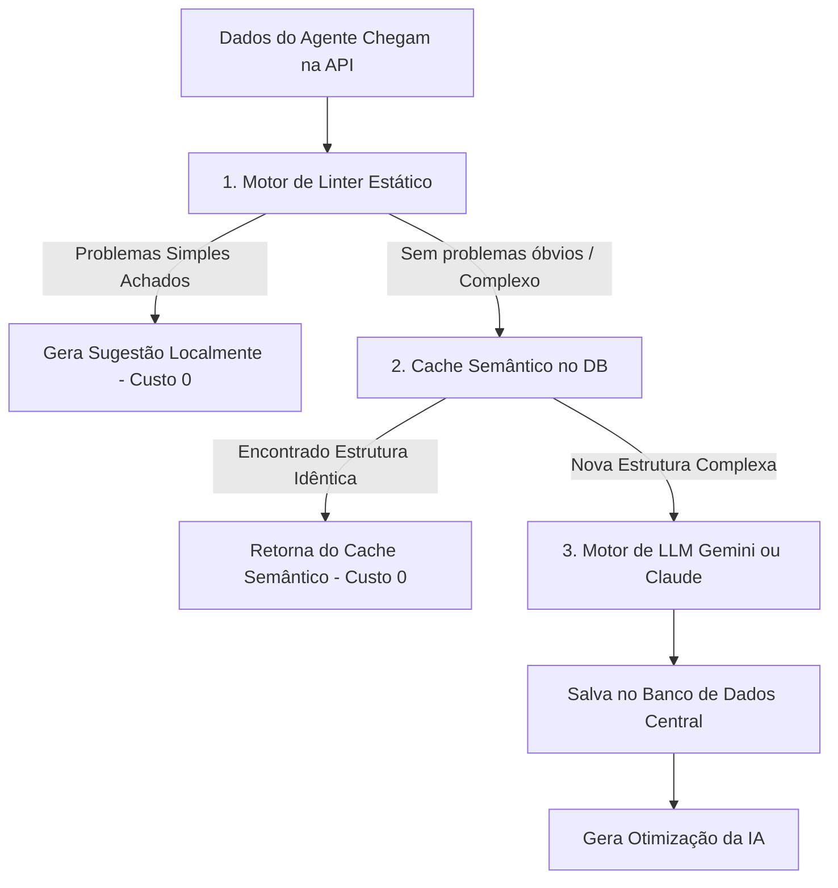

# 🛡️ Segurança, Governança e Fluxo de Otimização

A proposta de valor principal do **DBA Agent** repousa em dois pilares: **Segurança Cibernética Absoluta** e **Otimização de Banco de Dados de Alta Performance** de forma automatizada e com baixo custo. Esta página detalha as decisões estruturais que garantem esses pilares.

---

## 🔒 1. Segurança Rígida de Dados: Agent-Pull/Push

O maior receio de qualquer empresa de médio ou grande porte ao contratar um SaaS de banco de dados é a exposição de rede. Métodos tradicionais exigem a abertura de portas em firewalls (Porta `1433` para SQL Server ou `5432` para Postgres) ou a criação de VPNs para que servidores externos acessem o banco corporativo. 

### Como o DBA Agent resolve isso de forma blindada?
* **Arquitetura Reversa (Outbound Only):** O nosso Agente local faz conexões de **saída** apenas (Outbound) via HTTPS seguro (porta `443`). Ele atua como um coletor isolado.
* **Sem Escuta Externa:** O Agente não roda um servidor web ou socket de entrada. Portanto, mesmo que um invasor descubra o IP da máquina, não existem portas abertas para serem exploradas no software.
* **Isolamento de Dados Sensíveis:** O coletor Go está configurado para ler apenas tabelas de sistema e estatísticas de uso. Ele **nunca** faz consultas tipo `SELECT *` nas tabelas de negócios de clientes, protegendo a empresa contra vazamentos acidentais e leis de proteção de dados (como LGPD/GDPR).

---

## ⚡ 2. O Funil de Diagnóstico Inteligente

Para que o SaaS seja financeiramente viável e não esbarre em limitações de requisições por minuto (*rate limits*) ou alto custo de processamento nas LLMs, a análise de dados segue um fluxo de filtragem rigoroso:

### Passo 1: Motor de Linter (Regras Estáticas)
Antes de gastar qualquer token, a API Java roda análises rápidas baseadas em regras de álgebra relacional pré-programadas:
* Falta de chaves primárias.
* Chaves estrangeiras sem índices (o que causa lentidão severa em cascata).
* Tipos de dados obsoletos.

### Passo 2: Cache Semântico
Mapeia se outra tabela ou query com assinatura idêntica já foi analisada pelo Tenant. Se sim, a API serve o diagnóstico cacheado do PostgreSQL Central, economizando chamadas externas e respondendo instantaneamente.

### Passo 3: Motor de LLM (IA)
Utilizado exclusivamente para diagnósticos profundos que envolvem estatísticas dinâmicas, fragmentação de tabelas e queries longas.

---

## 📋 3. Governança e Ciclo de Vida do Deploy (Up/Down Scripts)

A Inteligência Artificial atua como um gerador de soluções, mas a **decisão final de execução pertence sempre a um ser humano qualificado**. O sistema adota uma máquina de estados segura:

| Status da Sugestão | Descrição | Ação Permitida |
| :--- | :--- | :--- |
| `AGUARDANDO_APROVACAO` | Sugestão gerada pela IA ou Linter. O script SQL de Deploy e Rollback estão disponíveis para análise do usuário. | Visualizar scripts, aprovar ou rejeitar. |
| `APROVADO` | O usuário clicou em aprovar no Dashboard. O status é salvo na API Central. | Aguardando consumo pelo Agente. |
| `EXECUTADO` | O Agente fez o polling periódico, identificou a aprovação, executou o script localmente e devolveu o log de sucesso. | Visualizar logs de auditoria e métricas de impacto. |
| `REPROVADO` | O usuário rejeitou a melhoria estrutural sugerida pela plataforma. | Nenhuma (arquivado para histórico). |

### 🛠️ Ciclo de Vida Seguro: Up/Down Scripts Obrigatórios
Qualquer sugestão enviada ao usuário é dividida em dois códigos SQL completos e independentes:
1. **Up-Script (Deploy):** O código SQL que executa a melhoria de fato (ex: `CREATE INDEX idx_user_email ON users(email) WITH (ONLINE = ON);`).
2. **Down-Script (Rollback):** O script exato necessário para anular a modificação caso ela cause algum comportamento inesperado (ex: `DROP INDEX idx_user_email ON users;`).
